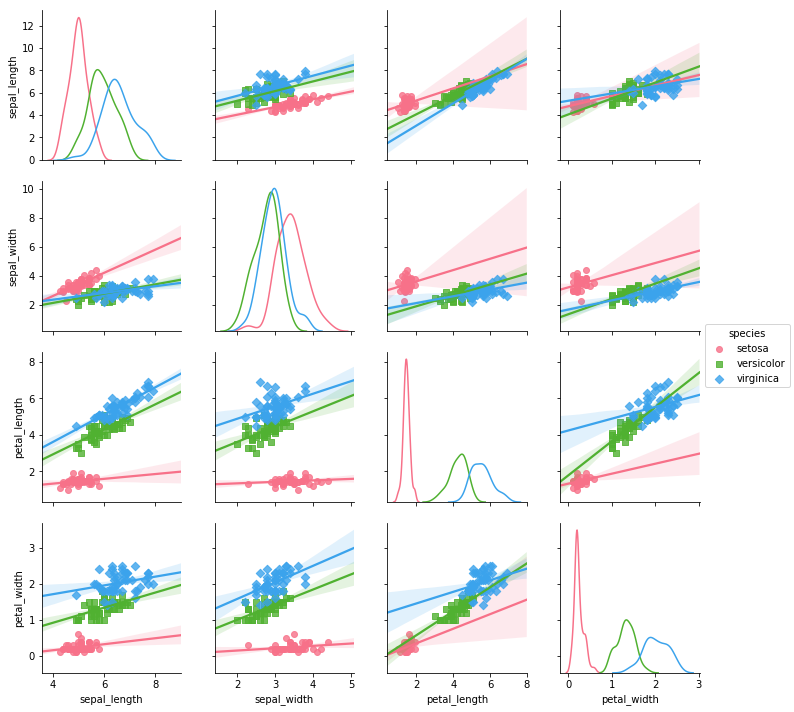
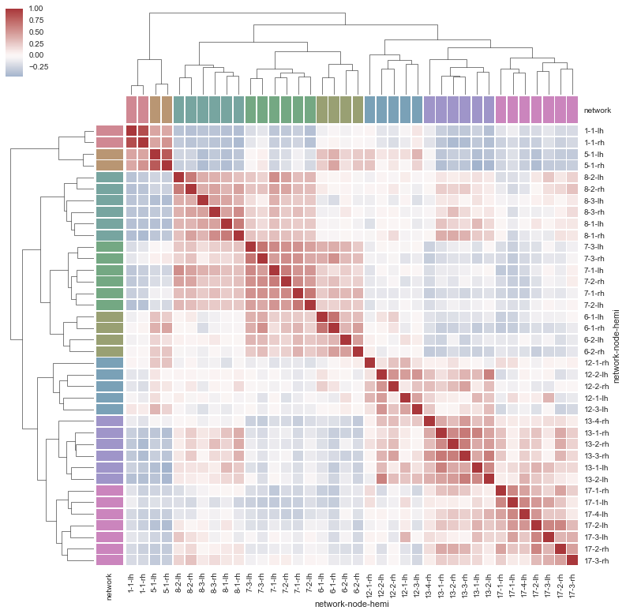

### jupyter notebook Posting Test

오늘은 jupyter notebook으로 생성된 파일인 `ipynb`로 github blog에 포스팅하는 것을 정리해볼까한다.

jupyter notebook파일을 바로 올리는 것으로 코드와 실행결과를 정리하기가 더욱 편해지지 않을까 싶다!


##### 1. 예제파일

우선 지금 글을 쓰고 있는 이 파일도 jupyter notebook파일로 실험하고 있다ㅎㅎ
간단한 파이썬 예제코드를 하나 작성해보자.


- 코드 예제


```python
# 필요 패키지 import
import numpy as np
import pandas as pd
import matplotlib.pyplot as plt
import seaborn as sns
```


```python
y = np.random.randint(1,3,10)
x = np.random.randint(1,3,10)
print(y)
print(x)
print(y*x)
```

    [2 2 1 1 2 2 1 2 1 2]
    [1 1 1 1 2 2 2 1 2 1]
    [2 2 1 1 4 4 2 2 2 2]


위와 같이 간단한 코드들과 결과들은 특별한 설정을 해줄 필요도 없이 바로 표시가 된다!

하지만 아래와 같이 결과를 이미지로 출력한 것들은 특별한 설정을 해주어야한다.


```python
iris = sns.load_dataset("iris")
sns.pairplot(iris, hue="species", markers=["o", "s", "D"], kind="reg", diag_kind="kde", palette="husl")
plt.show()
```





```python
iris = sns.load_dataset("iris")
g = sns.jointplot("sepal_width", "petal_length", data=iris,
                  kind="kde", space=0, color="g")
plt.show()
```


```python
sns.set()

# Load the brain networks example dataset
df = sns.load_dataset("brain_networks", header=[0, 1, 2], index_col=0)

# Select a subset of the networks
used_networks = [1, 5, 6, 7, 8, 12, 13, 17]
used_columns = (df.columns.get_level_values("network")
                          .astype(int)
                          .isin(used_networks))
df = df.loc[:, used_columns]

# Create a categorical palette to identify the networks
network_pal = sns.husl_palette(8, s=.45)
network_lut = dict(zip(map(str, used_networks), network_pal))

# Convert the palette to vectors that will be drawn on the side of the matrix
networks = df.columns.get_level_values("network")
network_colors = pd.Series(networks, index=df.columns).map(network_lut)

# Draw the full plot
sns.clustermap(df.corr(), center=0, cmap="vlag",
               row_colors=network_colors, col_colors=network_colors,
               linewidths=.75, figsize=(13, 13))
plt.show()
```





- 수식 예제

$$
\begin{align}
    f\left(x:\theta\right) = & \frac{1}{\sigma\sqrt{2\pi}}\exp\left(-\frac{\left(x-\theta\right)} {2\sigma^2}\right) \\
    M_X\left(t\right) = & \exp\left(\mu t + \frac{\sigma^2t^2}{2}\right) \\
    \phi_X\left(t\right)=& \exp\left(\mu it-\frac{1}{2}\sigma^2t^2\right) \\
    \text{I} = & \begin{pmatrix}
                    \frac{1}{\sigma^2}&0\\
                    0&\frac{1}{2\sigma^4}
                  \end{pmatrix}
\end{align} 
$$


##### 2. 파일 변환
우선 이렇게 만든 `ipynb`를 **markdown**파일로 변환을 시켜야 한다.

```powershell
> jupyter nbconvert --to markdown 변환시킬파일.ipynb
```


을 입력하면 원본파일명.md파일이 생성된다.

1. 이미지 파일의 경우엔 변환시킨 파일이 있는 폴더에 파일명과 같은 이름으로 이미지들이 저장된 폴더가 생성된다.
2. 그 이미지 폴더를 자신의 블로그의 이미지 저장소에 넣은 후, md파일에 수동으로1 (...) 이미지 파일을 넣어준다.
3. git에 push한다.


위와 같이 간단한 설정만으로 ipynb로 포스팅을 즐길수 있다!

그리고 원래 지킬에 올릴때 헤더부분에 쓰던 설정을 사용안해도 올라는 가지만 태그 구분이 안되므로 수동으로 넣어주자(.....불편한게 은근 많다!!)


- 추후에 이미지 설정하는 것이 있나 더 알아보자!


[1]: 이거 은근 귀찮다 -_-;뭔가 방법을 찾아야할듯.


위와 같이 간단한 설정만으로 `ipynb`로 포스팅을 즐길수 있다!
