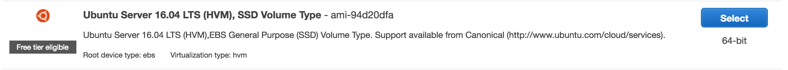
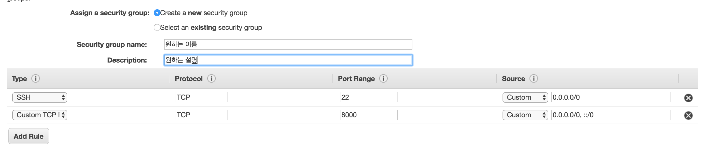
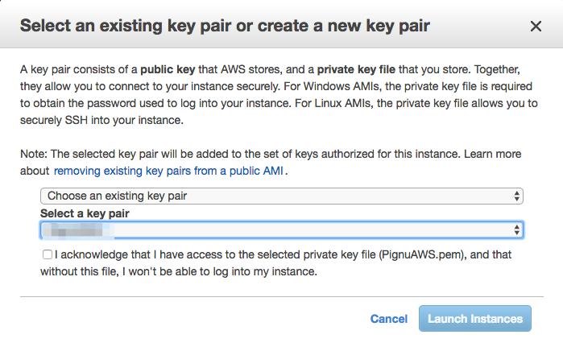
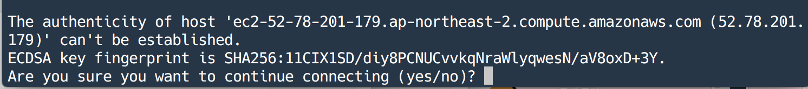

#### 00. AWS란?

[AWS](https://aws.amazon.com/ko)는 아마존닷컴에서 제공해주는 각종 원격 컴퓨팅 시스템이다.

**AWS**는 크게 4가지[^1] 서비스 영역을 지니고 있는데 우리는 구중 EC2를 이용하는 Compute영역을 이용해서 간단하게 서버를 구축해볼 것이다.


#### 01. 사용법

- 우선 [AWS](https://aws.amazon.com/ko)에서 회원가입을 한다.[^2] 

  > - **기본**
  >
  >   설명: 계정 및 과금 관련 질문 및 AWS 커뮤니티 포럼 액세스에 대한 고객 서비스.요금: 포함됨
  >
  > - 개발자
  >
  >   사용 사례: AWS 체험설명: 1차 접촉자는 지원 센터를 통해 기술 관련 질의를 하고 12~24시간 내(해당 지역 업무 시간 중)에 그에 대한 응답을 받을 수 있습니다.요금: 49 USD/월
  >
  > - 비즈니스
  >   사용 사례: 생산 용도로 AWS 사용하기설명: 전화 및 채팅을 통한 연중무휴 24시간 지원, 긴급 지원 상황에 대한 1시간 내 응답 및 일반 타사 소프트웨어 지원. AWS 인프라 최적화 용도의 AWS Trusted Advisor에 대한 완전한 액세스 권한, 그리고 지원 사례 자동화 및 Trusted Advisor 결과 조회 용도의 AWS Support API에 대한 액세스 권한.요금: 100 USD/월

  <br><br>

- [EC2 설정 페이지](https://ap-northeast-2.console.aws.amazon.com/ec2/v2/home?region=ap-northeast-2#)에 이동

  `Launch Instance`버튼을 눌러 **Instance**를 세로 생성한다.
  

  1. **Choose an Amazon Machine Image (AMI)**
     여러가지 버전의 OS를 제공해주지만 우리는 *ubuntu Server*를 이용해서 설치하자. 다음버튼을 누른다.

  2. **Choose an Instance Type**

     `Free tier eligible`[^3]이라 적혀있는 `General purpose`를 누르고 다음을 선택한다.

  3. **Configure Instance Details**

     설정을 변경할 것이 없다.

  4. **Add Storage**

     설정을 변경할 것이 없다.

  5. **Add Tags**

     설정을 변경할 것이 없다.

  6. **Configure Security Group**
     

     좌하단의 `Add Rule`버튼을 눌러서 우리가 사용할 *8000* 번 포트를 추가하자.

  7. 이제 여지것 했던 설정을 확인하고 서버를 생성한다.
     <br><br>

  8. 이제 *private key*를 설정한다.
     
     이미 private key를 가지고 있으면 원래 가지고 있던것을 설정하고 만약에 없다면 `create new key`를 누르고 파일은 다운로드하자.

     관리를 편리하게 하기 위해서 `~/.ssh`폴더에 다운 받은 파일을 저장하자. 저장 후 계정의 소유자 이외에는 접근하지 못하도록 권한을 변경시켜준다.

     ```shell
     $ chmod 440 [pirvateKEY 입력]
     ```

     <br><br>

  9. **server에 SSH연결**
     [EC2 설정 페이지](https://ap-northeast-2.console.aws.amazon.com/ec2/v2/home?region=ap-northeast-2#)에서 `instance`로 들어가면 `Public DNS:`가 우리 서버의 주소이다.

     ```shell
     $ ssh -i [pirvateKEY] ubuntu@[Public DNS]
     ```

     위의 명령어를 입력하여 리눅스 서버로 접속이 가능하다.

     

     첫 접속시엔 이런 질문이 나올 수가 있는데 이때는 yes를 눌러 통과시킨다.

- [IAM Dashboard](https://console.aws.amazon.com/iam/home?region=ap-northeast-2#/home)으로 이동

  1. 위의 주소로 이동한다음 `Create individual IAM users`를 누른 후 `Add User`를 누른다.
  2. ID는 원하는 걸로 설정, `Programmatic access`를 누르고 다음.
  3. `Attach exsisting policies directly`를 선택, `AmazonEC2FullAccess`를 선택해준다.
  4. 그리고 user를 생성한 다음 `Access ID`와 `Secret access Key`를 어딘가에 저장해두자.
     <br><br>


​	

#### 03. 우분투 설정

이 작업은 위에서 만든 서버가 아닌 내 로컬 컴퓨터에서 실행하자.

1. **AWS Command Line Interface**설치

   ```shell
   $ pip install awscli
   ```

2. **AWS Configure**

   ```shell
   $ aws configure
   AWS Access Key ID [None]: 만든 유저 키
   AWS Secret Access Key [None]: 만든 유저 키
   Default region name [None]: ap-northeast-2
   Default output format [None]: json
   ```

3. **내 컴퓨터에서 AWS서버로 파일 업로드하기**
   파일 업로드는 [scp](https://zetawiki.com/wiki/리눅스_scp_사용법)명령어를 이용한다.

   ```powershell
   $ scp -i [privateKey] -r [업로드할 폴더] ubuntu@[Public DNS]
   ```

   - priaveKey : 위에서 생성하고 `./ssh`에 넣었던 private 키
   - public DNS: 위에서 언급한 DNS주소


----

[^1]: 나머지 3개는 S3를 이용한 저장공간, RDS를 이용한 데이터베이스, VPC를 이용한  네트워킹이다.
[^2]: 회원가입을 할때 무료 버전으로 하면 1년간 무료다.
[^3]: 이게 무료이다.